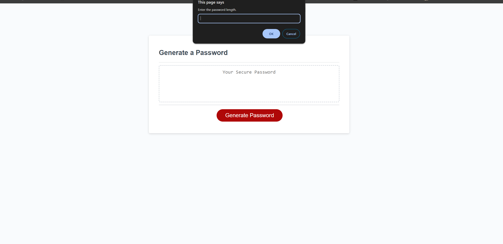

# Password Generator Starter Code

## User Story
 
AS AN employee with access to sensitive data
I WANT to randomly generate a password that meets certain criteria
SO THAT I can create a strong password that provides greater security

## Description

In this repository, you will find the source code of a random password generator. The HTML, CSS, and partial JS was written by [Xandromus](https://github.com/Xandromus). 

## Screenshots

## Contact 

<https://github.com/shinhye-ji>

## Live Link

<https://shinhye-ji.github.io/Password-Generated-Starter-Code/>

